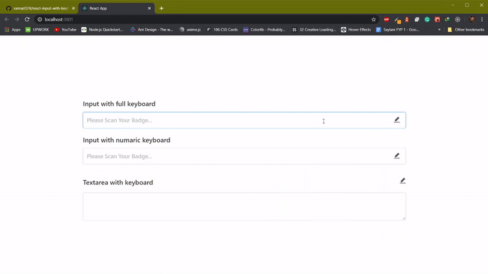

# React Input with Keyboard ⌨️

## Preview



## Installation

You can install this package with the following command:

`yarn add react-input-with-keyboard`

or

`npm install react-input-with-keyboard`

## How to use

you can also see this [example](https://github.com/samad324/react-input-with-keyboard-example)

### Usage

```js
import React, { Component } from "react";
import { TextInput, Textarea } from "react-input-with-keyboard";
import "./App.css";

class App extends Component {
  constructor(props) {
    super(props);

    this.state = {
      input1Val: "",
      input2Val: "",
      input3Val: ""
    };
  }
  onChangeTextField = (key, value) => {
    this.setState({
      [key]: value
    });
  };

  render() {
    const { input1Val, input2Val, input3Val } = this.state;
    return (
      <div className="App">
        <TextInput
          text={"Input with full keyboard"}
          placeholder="Please Scan Your Badge..."
          value={input1Val}
          containerClassName="inpContainer"
          keyboardKeyClassName="keyboardKeyStyles"
          onChange={text => this.onChangeTextField("input1Val", text)}
        />
        <TextInput
          text={"Input with numaric keyboard"}
          placeholder="Please Scan Your Badge..."
          value={input2Val}
          fullKeyboard={false}
          type="number"
          keyboardKeyContainerClassName="keyContainerClass"
          containerClassName="inpContainer"
          onChange={text => this.onChangeTextField("input2Val", text)}
        />
        <Textarea
          text={"Textarea with keyboard"}
          value={input3Val}
          fullKeyboard={true}
          onChange={value => this.onChangeTextField("input3Val", value)}
          containerClassName="inpContainer"
        />
      </div>
    );
  }
}

export default App;
```

### Props

| Props                         | Type         | Notes                                                                     |
| ----------------------------- | ------------ | ------------------------------------------------------------------------- |
| containerClassName            | `string`     | className of the main Input wrapper.                                      |
| text                          | `string`     | Heading of Input.                                                         |
| textStyles                    | `string`     | Heading className                                                         |
| error                         | `bool`       | for showing error                                                         |
| inputClassName                | `string`     | input className                                                           |
| placeholder                   | `string`     | placeholder of the input                                                  |
| value                         | `string`     | value of the input                                                        |
| size                          | `string`     | size of the input, i.e. `large` `default` and `small`                     |
| onFocus                       | `function`   | callback function for onFocus event                                       |
| onBlur                        | `function`   | callback function for onBlur event                                        |
| onChange                      | `function`   | callback function for onChange event                                      |
| type                          | `string`     | type of input, i.e `text` `number` etc.                                   |
| disabled                      | `bool`       | flag for disable the input or not.                                        |
| id                            | `string`     | id for the input.                                                         |
| fullKeyboard                  | `bool`       | flag for allow full keyboard on input or just numaric keyboard            |
| hideOnSmallDevice             | `bool`       | if you want to hide keyboard icon on small devices like moble and tablets |
| keyboardIcon                  | `React.node` | icon for the keyboard, which is show on right side of the input           |
| keyboardIconColor             | `string`     | color of the keyboard icon                                                |
| iconClassName                 | `string`     | className for keyboard icon                                               |
| keyboardKeyClassName          | `string`     | className for the text inside the keyboard's key                          |
| keyboardKeyContainerClassName | `string`     | className for the keyboard's key                                          |
